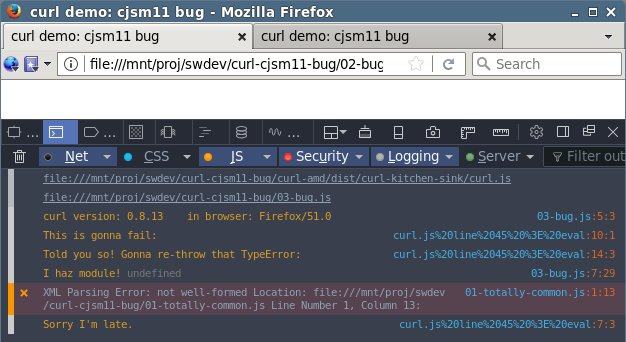

curl-cjsm11-bug
===============

Files have numbers because I planned to make this a gist,
until I noticed gists can't show images.

Suppose you have a CommonJS module that tries to use an unsupported feature:

#### 01-totally-common.js
<!--#include file="01-totally-common.js" code="javascript" -->
<!--#verbatim lncnt="21" -->
```javascript
'use strict';

var thingy = { common: true, js: true };
module.exports = thingy;

setTimeout(function () {
  console.log("Sorry I'm late.");
}, 10);

console.log('This is gonna fail:');
try {
  Function.notSupportedInThisBrowser();
} catch (err) {
  console.log('Told you so! Gonna re-throw that', String(err).split(/ /)[0]);
  throw err;
}
console.log('Still alive!?');

thingy.totally = true;
```
<!--/include-->


And you load it with curl using this HTML and JS…

#### 02-bug.html
<!--#include file="02-bug.html" code="html" -->
<!--#verbatim lncnt="9" -->
```html
<!DOCTYPE html><html><head>
  <meta http-equiv="Content-Type" content="text/html; charset=UTF-8">
  <title>curl demo: cjsm11 bug</title>
</head><body>
  <script src="curl-amd/dist/curl-kitchen-sink/curl.js"></script>
  <script src="03-bug.js"></script>
</body></html>
```
<!--/include-->

#### 03-bug.js
<!--#include file="03-bug.js" code="javascript" -->
<!--#verbatim lncnt="12" -->
```javascript
/*jslint indent: 2, maxlen: 80, browser: true */
(function () {
  'use strict';
  var curl = window.curl;
  console.log('curl version:', curl.version,
    '\tin browser:', navigator.userAgent.match(/\S+$/)[0]);
  function onModLoad(mod) { console.log('I haz module!', mod); }
  function onModFail(err) { console.error('Y u no module?', err); }
  curl('curl/loader/cjsm11!./01-totally-common.js', onModLoad, onModFail);
}());
```
<!--/include-->


… over HTTP:


* Why is our log statement the only clue that an Error was thrown?
  Where's the re-thrown error gone?

* Why is the `onModLoad` function invoked and `onModFail` isn't?
  * The cjsm11 loader clearly knows something went wrong,
    as it didn't grab the `modules.exports` even though it was
    partially prepared at the time the error was thrown.


It gets even more confusing when you load it from the file system:



* What exactly isn't well-formed? If there were any syntax errors in the
  `01-totally-common.js`, it couldn't have been run, right?

* If there was an XML problem, why hide it from function `onModFail`?
  * Really confusing to report a non-relevant problem when at the same
    time the real problem is hidden from the errback. :-(
    This bug report started out as trying to register a callback that
    told users to re-try via HTTP in case of the XML error.
  * (other problems: same as above)
